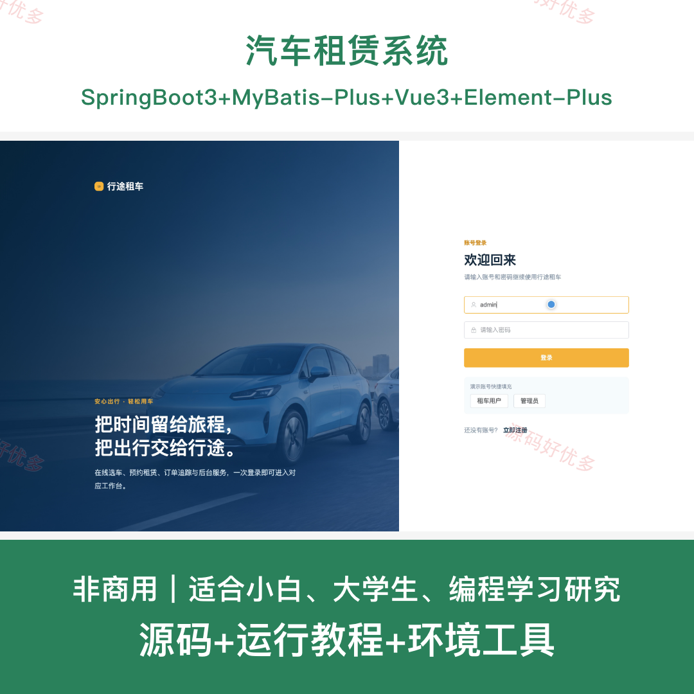
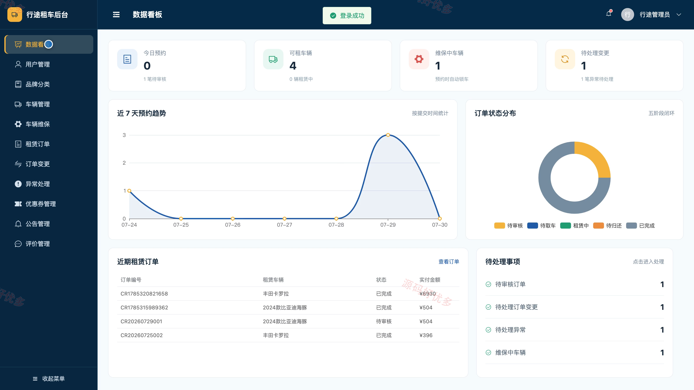
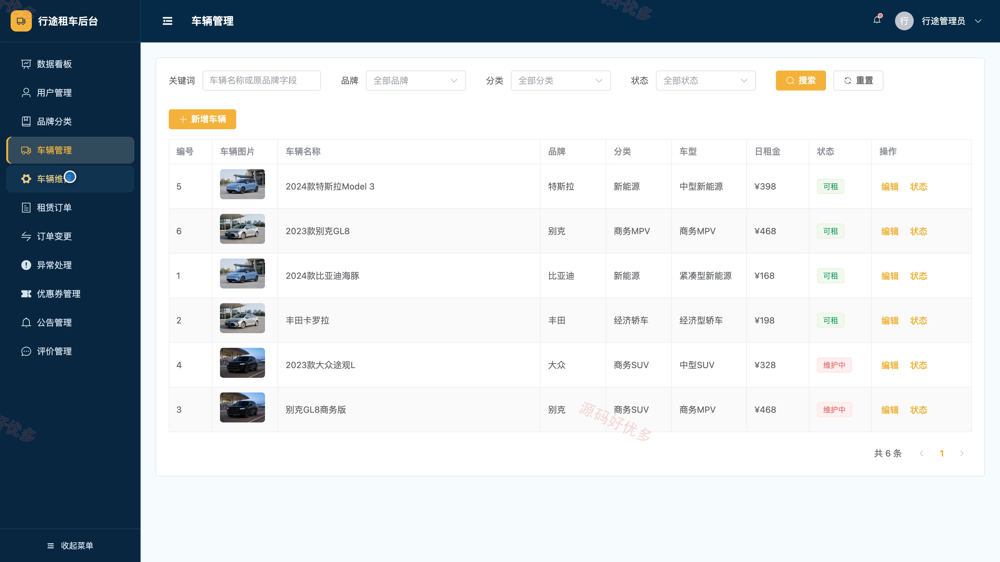
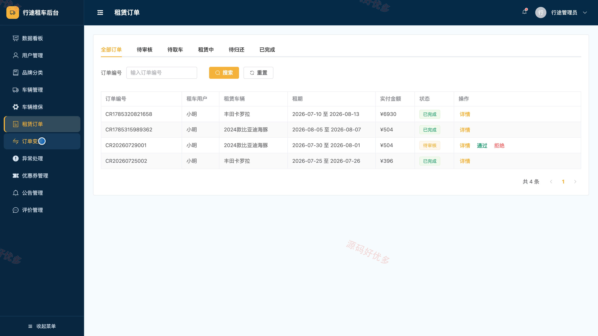
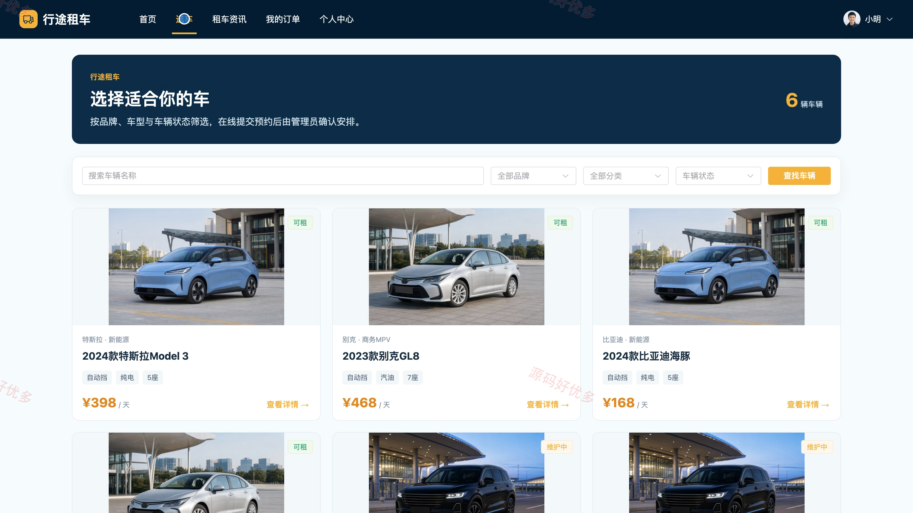
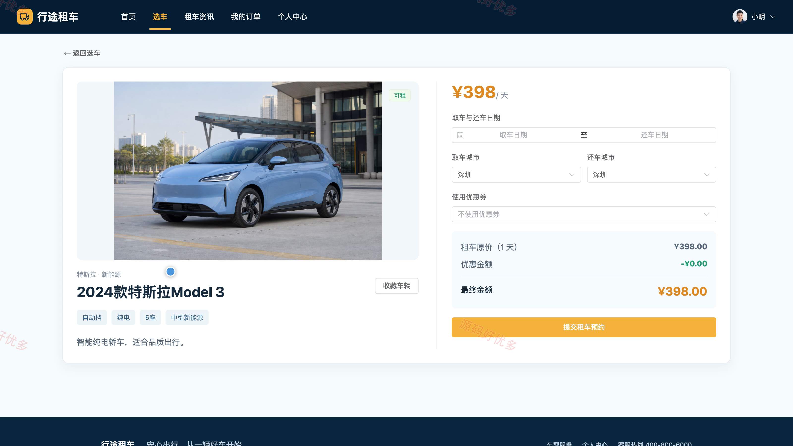
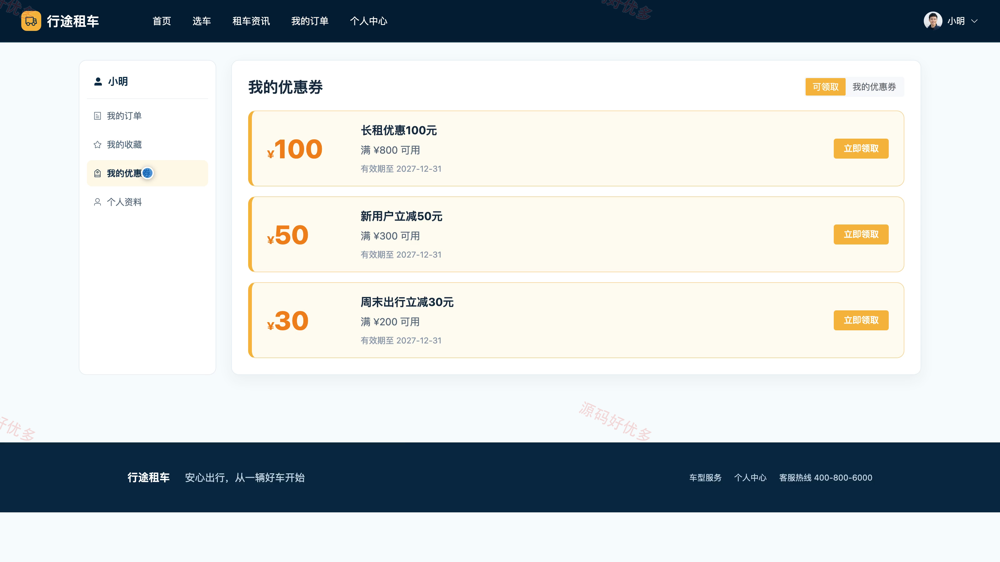

# bs006A
bs006A汽车租赁系统
## 源码问题查看主页咨询

### 一、关键词
汽车租赁系统、汽车租赁、汽车租赁信息管理、汽车租赁后台管理

### 二、作品包含
源码+数据库+全套环境和工具资源+本地部署教程

### 三、项目技术
前端技术： Html、Css、Js、Vue3.4、Element-Plus
后端技术：Java、SpringBoot3.2.0、MyBatis-Plus

### 四、运行环境（以下版本亲测，其他版本兼容性请自行测试）
开发工具：IDEA/eclipse + VSCODE

数据库：MySQL5.7+（共7张表）

数据库管理工具：Navicat10以上版本

环境配置软件： JDK17 + Maven3.6.3

前端Nodejs：16+

浏览器：谷歌浏览器

### 五、项目介绍
项目编号：bs006A

汽车租赁系统面向管理员、用户，提供项目核心业务等功能，实现各角色在系统中的实际业务协作。

角色：管理员、用户

管理员功能：数据看板与经营统计、用户及个人资料管理、品牌分类与车辆管理、车辆维保管理、租赁订单审核与状态管理、订单变更及异常处理、优惠券与公告管理、评价管理。

用户功能：首页浏览与车辆筛选、车辆详情查看与收藏、租赁预约、我的订单跟踪与详情查看、订单评价、租车资讯查看、优惠券领取与查看、个人资料维护。

### 六、运行截图

